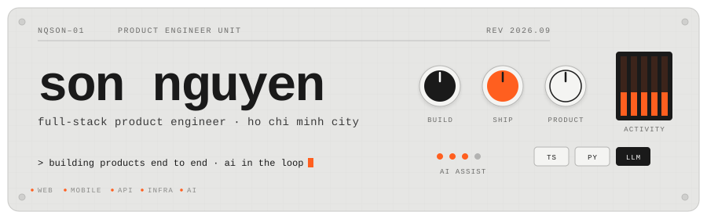
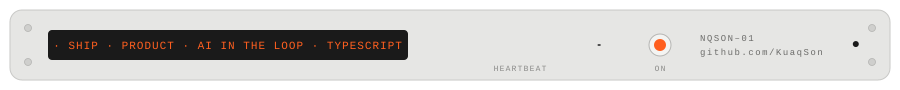

 

<table align="center" width="100%">
<tr>
<td width="50%" valign="top">

### `01` &nbsp;ai-native workflow

- **build** &nbsp;·&nbsp; pair with AI agents daily; write MCP servers and tools so agents can do more
- **ship** &nbsp;·&nbsp; LLM-generated commit messages, automated PR review, AI-assisted debugging
- **product** &nbsp;·&nbsp; wire models into real features: chat, writing assistance, speech, search

</td>
<td width="50%" valign="top">

### `02` &nbsp;what i build

- **business products** &nbsp;·&nbsp; from idea to production: web, mobile, API, and the infra that runs them
- **productivity apps** &nbsp;·&nbsp; planning, tracking, focus, usually born from my own itch
- **developer tooling** &nbsp;·&nbsp; starter templates, CLI helpers, small services that remove friction

</td>
</tr>
</table>

 

### `03` &nbsp;stack

<table align="center" width="100%">
<tr>
<td width="25%" align="center">FRONTEND  </td>
<td width="25%" align="center">BACKEND  </td>
<td width="25%" align="center">DATA &amp; INFRA  </td>
<td width="25%" align="center">MOBILE &amp; TOOLS  </td>
</tr>
</table>

 

### `04` &nbsp;featured

 

 

### `05` &nbsp;telemetry

 

  

 

